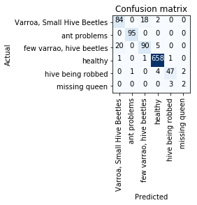
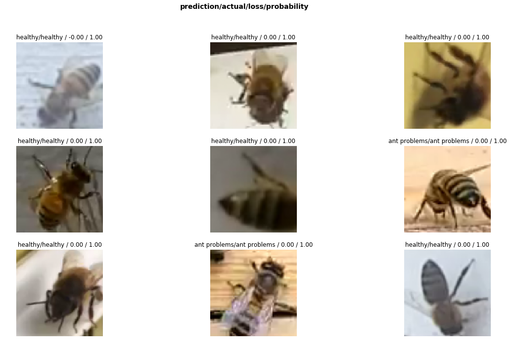
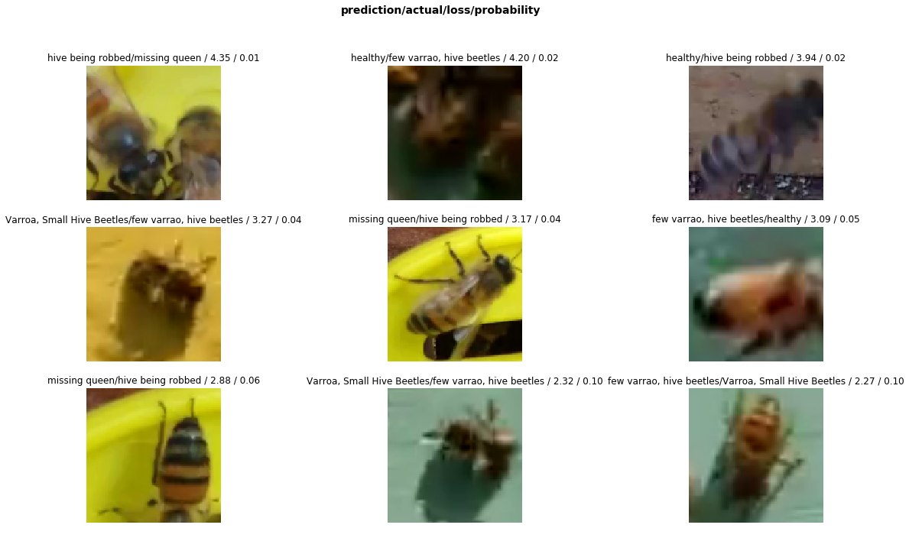

# Classifying Health of Honey Bees - Transfer Learning (resnet 34)

This is my first project with image classification. I recently started the FastAI MOOC and after completing Lesson 1, I took up the dataset at https://www.kaggle.com/jenny18/honey-bee-annotated-images to see if I could build a model to predict the health of the bees.

The performance I have achieved is shown below:

**Classification Report**

```
                        precision    recall  f1-score   support

Varroa, Small Hive Beetles       0.80      0.81      0.80       104
              ant problems       0.99      1.00      0.99        95
  few varrao, hive beetles       0.83      0.78      0.80       115
                   healthy       0.98      1.00      0.99       661
         hive being robbed       0.92      0.87      0.90        54
             missing queen       0.50      0.40      0.44         5

                 micro avg       0.94      0.94      0.94      1034
                 macro avg       0.84      0.81      0.82      1034
              weighted avg       0.94      0.94      0.94      1034
```

**Confusion Matrix**



**Some images where model performed the best**



**Some Images where the model Performed the worst**

